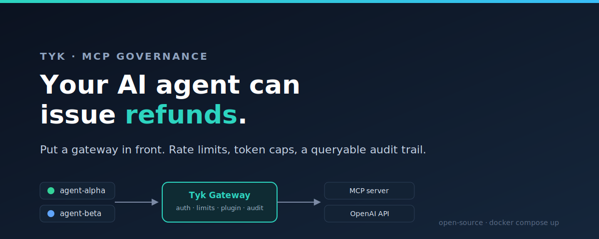
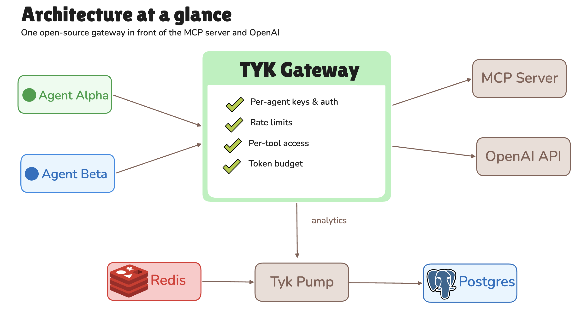
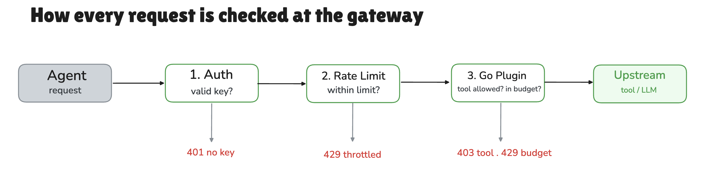

# Your AI agent can issue refunds. Time to put a gateway in front of it.

**Per-agent rate limits, a Go token-guard plugin, and an audit trail you can query. All on the free, open-source Tyk gateway.**



Teams are wiring AI agents up to internal tools through MCP, and a lot of them are doing it with no controls at all. Any agent can call any tool, as often as it likes, and nobody keeps a record. That's fine right up until an agent that was supposed to *read* orders starts *refunding* them.

James Hirst made this case on this blog, in ["AI agents need API gateways"](https://tyk.io/blog/ai-agents-need-api-gateways/), and the argument is hard to disagree with: agents recreate the exact problems that built the API gateway market in the first place, the ones where auth is a mess, there's no visibility, rate limiting is an afterthought, nothing gets audited, and the access rules live in someone's head. He's right about all of it. He also doesn't show you a single line of code.

This does. We're going to take a real MCP server, put it behind the open-source Tyk gateway, and hand two agents their own keys. Then we watch the gateway stop one of them from issuing refunds, throttle it when it floods us, cut it off when it burns through its token budget, and log every last call to a database you can query. No Dashboard, no license, no trial. [Clone the repo](https://github.com/mostafaibrahim17/tyk-mcp-governance): build the plugin, `docker compose up`, run one script, and watch it work.

## What you actually have to enforce

Strip out the protocol talk and it's a short list. Five things:

1. **Identity.** Every call is tied to a specific agent. No anonymous traffic.
2. **Access.** An agent can only call the tools it's allowed to call.
3. **Rate.** One agent can't flood a tool and drag everyone else down with it.
4. **Cost.** Each agent gets a token budget, and when it's gone, it's gone.
5. **Audit.** You can answer "which agent did what, when, and what did it cost" without guessing.

Everything below wires up those five. Here's the shape of it.



Two things sit behind the gateway: an MCP server exposing a couple of internal tools, and the OpenAI API. The gateway handles identity, rate, and audit for both on its own, but the two jobs it won't do out of the box are per-tool access and a per-agent token budget, so for those we write a Go plugin. A Go plugin is Go code you compile into a shared library and load into the gateway, which then runs it as custom middleware on the routes you choose.

That list of five isn't mine. Martin Buhr's ["twelve-point pre-production test for agents"](https://tyk.io/blog/if-you-cant-revoke-your-agent-you-dont-have-autonomy-you-have-unattended-traffic/) lands in the same place, running through identity, least privilege, rate limits and budgets, audit, and revocation, where his version is the checklist and this one is the wiring.

> **Before you start.** You'll need Docker, since the whole stack runs in Compose, and Python 3 to drive the client. A real `OPENAI_API_KEY` is needed for one step only, the token budget. Everything else, the gateway, Redis, Postgres, Tyk Pump, and even the plugin compiler, comes down as a container. [Clone the repo](https://github.com/mostafaibrahim17/tyk-mcp-governance) and you're set.

> **A note on Tyk's native MCP gateway.** Tyk 5.13.0 added a built-in MCP gateway that reads the JSON-RPC and applies per-tool rules for you, no plugin needed. It's open source, and the team wrote up the design in ["Building an MCP gateway from scratch"](https://tyk.io/blog/building-an-mcp-gateway-from-scratch-how-we-got-to-openapi-for-mcp/). The catch is a bug, not a paywall: in my testing, on a gateway with no Dashboard the OAS-format MCP definition didn't load cleanly from files, so the gateway took it and then acted as if it wasn't there. File-based OAS loading has known rough edges (see [tyk#7460](https://github.com/TykTechnologies/tyk/issues/7460)); the Dashboard sidesteps them by loading definitions from its own database. So the free no-Dashboard route today is a plugin, which is what this guide uses. More on the native path at the end.

## Stand up Tyk and put the MCP server behind it

The MCP server is a small [FastMCP](https://gofastmcp.com/) app with two tools, one that reads data and one that does the dangerous thing. An agent that can read your orders is a convenience; an agent that can refund them is a liability with a personality, and that split between the two is the whole point of per-tool access.

```python
from fastmcp import FastMCP

mcp = FastMCP("internal-tools")

@mcp.tool
def lookup_order(order_id: str) -> dict:
    """Look up an internal order by its ID. Read-only."""
    ...

@mcp.tool
def issue_refund(order_id: str, amount: float) -> dict:
    """Issue a refund against an order. Sensitive / state-changing."""
    ...

if __name__ == "__main__":
    # transport="http" is the current name for Streamable HTTP.
    mcp.run(transport="http", host="0.0.0.0", port=8000)
```

> **Streamable HTTP only.** Tyk is a network gateway, so it can't proxy a stdio MCP server. If yours speaks stdio, put a bridge in front of it. FastMCP serves Streamable HTTP already, so we're fine.

The `docker-compose.yml` brings up the gateway, Redis (Tyk needs it, even for one node), the MCP server, Tyk Pump, and Postgres. The gateway runs in open-source mode and reads its config from files. Putting the MCP server behind it means pointing a Tyk API at it:

```json
// tyk/apps/internal-tools.json (excerpt)
"proxy": {
  "listen_path": "/internal-tools/",
  "target_url": "http://mcp-server:8000",
  "strip_listen_path": true
},
"use_keyless": false,
"use_standard_auth": true,
"auth": { "auth_header_name": "apikey" }
```

Now the gateway serves the MCP server at `http://localhost:8080/internal-tools/mcp`, and it asks for a key, because we turned keyless access off. One warning, learned the hard way: keep `mcp` out of the `api_id`. A classic def whose `api_id` held `mcp` loaded without complaint and then acted like it didn't exist, as if the name were being routed to the built-in MCP path. Renaming it fixed it at once. I lost an afternoon to that so you don't have to.

## One key per agent: identity and rate limits

Every request runs the same set of checks, and any one of them can stop it before it reaches a tool or the model.



With keyless off, every call needs a key, so we hand one to each agent, and now every request has a name on it. Each key carries its own access rights, its own rate limits, and some metadata the plugin reads later.

```bash
curl -H "x-tyk-authorization: $SECRET" -X POST http://localhost:8080/tyk/keys -d '{
  "org_id": "default",
  "alias": "agent-alpha",
  "access_rights": {
    "internal-tools": { "api_id": "internal-tools", "versions": ["Default"],
                        "limit": { "rate": 20, "per": 60 } },
    "openai-llm":     { "api_id": "openai-llm", "versions": ["Default"],
                        "limit": { "rate": 1000, "per": 60 } }
  },
  "meta_data": { "token_budget": 150, "allowed_tools": "lookup_order" }
}'
```

`agent-alpha` is the junior account, on a tight rate limit with only `lookup_order` on its list, while `agent-beta` gets room to move and both tools. Throw a burst at the gateway and the two stay out of each other's way:

```
agent-alpha 30 rapid calls -> [400 400 400 400 400 429 429 429 ...]
    5 reach the server, then the rest are rejected with 429 (rate limit tripped)
agent-beta call during alpha's burst -> reaches the server, unaffected
```

(Those `400`s are the MCP server, not the gateway: the raw burst skips the MCP handshake, so the server turns it away. What matters is the gateway's part: it lets a small burst through, then throttles the rest with 429.) One agent hammers a tool and trips its own 429s while the other, calling at the same moment, doesn't feel a thing. That's the isolation, and the gateway hands it to you for free.

## Per-tool access in a Go plugin

Rate limits count requests, but they can't tell a call for `issue_refund` from a call for `lookup_order`. The open-source gateway treats MCP as plain HTTP, so we teach it to read the difference: a small hook reads the JSON-RPC body and checks the tool name against the agent's list.

```go
func McpAccessControl(rw http.ResponseWriter, r *http.Request) {
    body, _ := io.ReadAll(r.Body)
    r.Body = io.NopCloser(bytes.NewReader(body)) // restore for the upstream

    var msg struct {
        Method string `json:"method"`
        Params struct{ Name string `json:"name"` } `json:"params"`
    }
    json.Unmarshal(body, &msg)
    if msg.Method != "tools/call" { return }

    allow, restricted := allowedTools(r) // from key meta_data.allowed_tools
    if restricted && !allow[msg.Params.Name] {
        rw.WriteHeader(http.StatusForbidden)
        io.WriteString(rw, `{"jsonrpc":"2.0","error":{"code":-32001,"message":"tool not permitted"}}`)
    }
}
```

Run the two agents and alpha's refund gets turned away at the door. Beta's goes through:

```
agent-alpha  lookup_order(A-1001) -> {"status": "shipped", ...}
agent-alpha  issue_refund(A-1001) -> BLOCKED by Tyk (403)
agent-beta   issue_refund(A-1001) -> {"status": "refund_issued", ...}
```

## A token guard on the LLM call

What an LLM call actually costs is tokens, not requests, and that math is specific to your setup, so the gateway leaves it to you. The same plugin takes care of it on a second route that fronts OpenAI, where a response hook reads `total_tokens` off each reply and adds it to that agent's running total.

```go
func MeterTokens(rw http.ResponseWriter, res *http.Response, req *http.Request) {
    body, _ := io.ReadAll(res.Body)
    res.Body = io.NopCloser(bytes.NewReader(body)) // restore for the client
    var parsed struct{ Usage struct{ TotalTokens int64 `json:"total_tokens"` } `json:"usage"` }
    json.Unmarshal(body, &parsed)
    mu.Lock(); spent[agentID(req)] += parsed.Usage.TotalTokens; mu.Unlock()
}
```

A second hook runs before the call goes out, and if the agent is already over budget the request stops right there and never reaches OpenAI. That same hook swaps in the real OpenAI key, so the agents only ever talk to Tyk and never hold the key themselves.

```go
func EnforceBudget(rw http.ResponseWriter, r *http.Request) {
    id, budget := agentID(r), budgetFor(r)
    mu.Lock(); used := spent[id]; mu.Unlock()
    if used >= budget {
        rw.WriteHeader(http.StatusTooManyRequests)
        io.WriteString(rw, `{"error":"token budget exhausted"}`)
        return // upstream is never called
    }
    r.Header.Set("Authorization", "Bearer "+os.Getenv("OPENAI_API_KEY"))
}
```

Give alpha a 150-token budget and it gets only a few calls before the gate shuts, how many depends on how many tokens each reply spends, since the guard counts real `total_tokens`. Beta, on a big budget, keeps going. One representative run:

```
agent-alpha (budget 150):  call 1: 200 (+52)  call 2: 200 (+49)  call 3: 200 (+55)  call 4: 429 budget exhausted
agent-beta  (budget 100000): 200 200 200 200 200 200 200
```

> **Two things to remember.** OpenAI leaves usage out of streamed replies unless you ask for it with `stream_options`, so the guard sticks to plain, non-streamed calls. And this counter lives in the gateway's memory, which is fine for one node. Run two and they'll each think the agent still has budget, which rather defeats the point. Move the count into Redis before you scale out.

### Build the plugin for your exact gateway

Here's the part that catches everyone. A Go plugin has to be built against the same gateway version, the same build flags, and the same CPU type. Get any of those wrong and the gateway won't load it, and it won't tell you why. Tyk ships a compiler image pinned to each version so the match is exact:

```makefile
docker run --rm -v "$(CURDIR)":/plugin-source --platform=linux/amd64 \
  -e GO_GET=1 -e GO_TIDY=1 \
  tykio/tyk-plugin-compiler:v5.14.0 token_guard.so plugin-v5.14.0
```

`GO_GET=1` fetches the exact Tyk gateway dependency for you (Tyk marks it a dev-only convenience, but it works). Bump the gateway version and you bump the compiler tag with it. (If none of this sounds like a good time, Tyk AI Studio does cost budgets and model governance as a separate Tyk product, no plugin required.)

## An audit trail you can query

The gateway writes its logs to Redis. Tyk Pump moves them somewhere permanent. Point it at Postgres:

```json
// pump/pump.conf (excerpt)
"pumps": { "postgres": { "type": "sql", "meta": {
  "type": "postgres",
  "connection_string": "host=postgres port=5432 user=tyk password=tyk dbname=tyk_analytics sslmode=disable"
} } }
```

Now every call is a row in `tyk_analytics`, tagged with the agent's alias. Turn on detailed recording and the request and response bodies ride along too, which means the tool name and the token count are both in there. One query gives you spend per agent:

```sql
SELECT alias AS agent,
       COUNT(*) AS llm_calls,
       SUM((regexp_match(convert_from(decode(rawresponse,'base64'),'UTF8'),
            'total_tokens"?\s*:\s*(\d+)'))[1]::int) AS total_tokens
FROM tyk_analytics
WHERE api_name = 'openai-llm' AND responsecode = 200
GROUP BY alias;
```

```
   agent    | llm_calls | total_tokens
------------+-----------+--------------
 agent-alpha|         3 |          156
 agent-beta |         7 |          361
```

(Figures from one run; your exact token totals will differ, since each reply's token count is real.) That's the question compliance asks, which agent did what, when, and what did it cost, and "we didn't log it" is not an answer they enjoy. Here it's one query.

## The five controls, and what enforces each

That's the whole build. Below, each control is mapped to the piece of the stack that holds it:

- **Identity.** Keyless access off, one auth key per agent. Every call has a name on it. (*Tyk, out of the box.*)
- **Access.** A per-tool allow-list checked against the JSON-RPC body, so `agent-alpha` can read orders but never refund them. (*Go plugin, `McpAccessControl`.*)
- **Rate.** Per-key rate limits, isolated per agent, so one flooder can't drag the rest down. (*Tyk, out of the box.*)
- **Cost.** A per-agent token budget, metered off the model's own `total_tokens`, that shuts the gate when it's spent. (*Go plugin, `EnforceBudget` and `MeterTokens`.*)
- **Audit.** Every call a row in Postgres, tagged by agent, answerable in one SQL query. (*Tyk Pump into Postgres.*)

Three of the five come free with the open-source gateway, and the other two are a couple hundred lines of Go. That's the entire bill.

## Rough edges, and where to go next

A few gotchas: match the plugin to your gateway version and rebuild on upgrade, put a bridge in front of any stdio server, keep `mcp` out of your `api_id`, and move the token counter to Redis before you run a second node.

The one real choice is per-tool MCP control, and we put it in a plugin because that runs on the free gateway anywhere today. Tyk's native MCP gateway does the same job with no code but still needs the Dashboard for now, thanks to that bug from earlier, so it's where you go when the plugin starts to feel like a second job. If you want cost and model governance handled for you instead of in your own code, that's what Tyk AI Studio is for.

You don't need any of that to start. One free gateway turns those five problems into rules that hold. The refund never happens. The flood gets throttled. The budget runs out. And every call is on the record.

## Further reading

- [The companion repo](https://github.com/mostafaibrahim17/tyk-mcp-governance): the full stack from this post. Build the plugin, `docker compose up`, run the client.
- James Hirst, ["AI agents need API gateways"](https://tyk.io/blog/ai-agents-need-api-gateways/): the argument this post answers with code.
- [The Model Context Protocol spec](https://modelcontextprotocol.io/): what MCP actually is.
- [FastMCP](https://gofastmcp.com/): the Python framework used for the demo server.
- [Tyk MCP Gateway docs](https://tyk.io/docs/ai-management/mcp-gateway/): the native, Dashboard-managed path.
