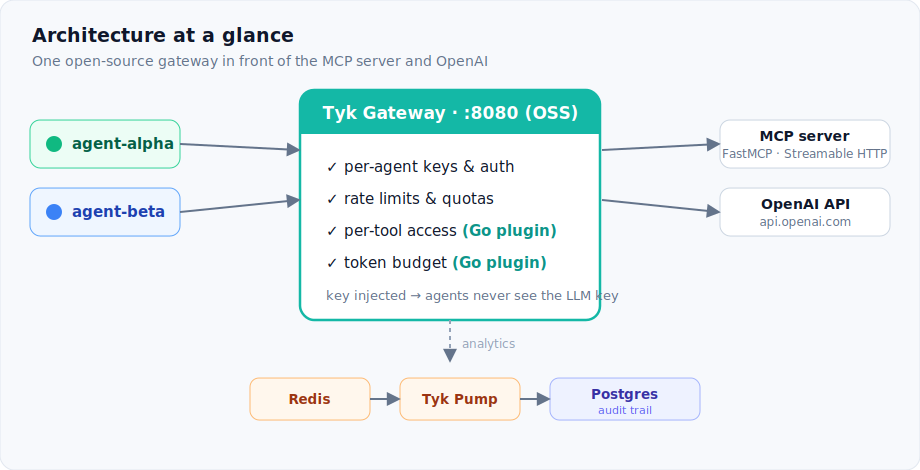
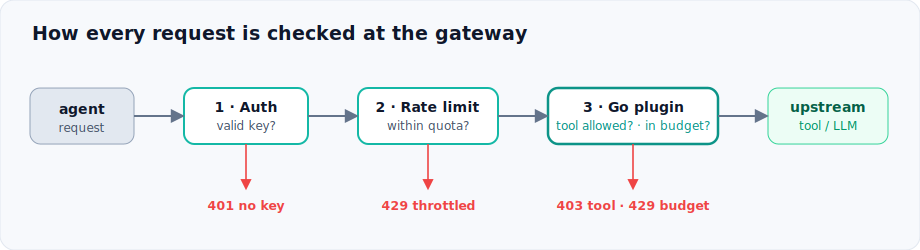

# Putting an MCP server behind Tyk


A runnable governance stack for AI-agent traffic, built entirely on the
**open-source Tyk Gateway** (MPL 2.0, no license, no Dashboard). One gateway
sits in front of two upstreams:

- an **MCP server** (FastMCP, Streamable HTTP) exposing internal tools
- the **OpenAI API**

The gateway enforces the five things raw MCP leaves to you: per-agent **auth**,
**rate limits**, per-tool **access control**, a custom **token budget**,
and a SQL-queryable **audit trail**.



> **OSS vs Dashboard.** This repo runs on the **free open-source gateway**, so the MCP
> server is proxied as a classic Tyk API and per-tool access control is done in the Go
> plugin (which parses the JSON-RPC body). Tyk's **native MCP Gateway** does the same
> declaratively (per-tool rate limits, filtered `tools/list` discovery, JSON-RPC policy),
> and it's fully open source. The catch is a bug, not a paywall: on a Dashboard-less
> gateway the OAS/MCP definitions don't currently mount (an open file-loader issue,
> [tyk#7460](https://github.com/TykTechnologies/tyk/issues/7460), silently skips OAS
> defs). The Dashboard loads them a different way, so today native MCP needs it, or a
> plugin like this one. See the article for more.

## What's here

| Path | What it is |
|------|-----------|
| `docker-compose.yml` | Gateway, Redis, Pump, Postgres, MCP server |
| `mcp-server/server.py` | FastMCP server: `lookup_order` (read), `issue_refund` (sensitive) |
| `plugin/token_guard.go` | Go plugin: per-tool MCP access control + meters `usage.total_tokens` and rejects over-budget agents |
| `tyk/apps/*.json` | Tyk classic API defs (MCP proxy + OpenAI route, both with the plugin bound) |
| `tyk/bootstrap/setup.sh` | Issues one key per agent (with per-API rate limits + tool allow-list) |
| `client/agent.py` | Drives both agents; shows every control firing |
| `sql/audit.sql` | Per-agent call volume, errors, token spend |

## Run it

Requires Docker. A real `OPENAI_API_KEY` is only needed for the token-budget
demo (step 4).

```bash
# 0. Clone
git clone https://github.com/mostafaibrahim17/tyk-mcp-governance
cd tyk-mcp-governance

# 1. Configure
cp .env.example .env         # set OPENAI_API_KEY for the LLM demo

# 2. Build the Go plugin against the exact gateway version (Docker-based).
#    A plugin .so must match the gateway's toolchain/version/arch or it won't load.
make -C plugin plugin

# 3. Start the stack and issue per-agent keys
docker compose up -d
./tyk/bootstrap/setup.sh

# 4. Drive it (needs Python: pip install -r client/requirements.txt)
python client/agent.py

# 5. Query the audit trail (either works)
psql "host=localhost port=5433 user=tyk password=tyk dbname=tyk_analytics" -f sql/audit.sql
# ...or without a local psql:
docker compose exec -T postgres psql -U tyk -d tyk_analytics -f - < sql/audit.sql
```

## What you should see

Every request runs the same set of checks, and any one of them can stop it:



- **Per-tool access control:** both agents can list tools, but `agent-alpha`'s `issue_refund` call is blocked (`403`) by the plugin while `agent-beta`'s succeeds.
- **Rate-limit isolation:** `agent-alpha` bursts and trips `429`s while `agent-beta` is unaffected. (In the raw burst the pre-`429` requests return `400`, because it skips the MCP handshake; the gateway lets a few through, then throttles.)
- **Token budget:** each agent's OpenAI calls succeed until cumulative `total_tokens` crosses its budget, then `429 token budget exhausted`. The Go plugin enforces it, per agent.
- **Audit trail:** `audit.sql` returns per-agent call counts, error counts, and summed token spend from Postgres.

## Notes & gotchas

- **Version pinning is not optional.** The plugin is compiled with
  `tykio/tyk-plugin-compiler:v5.14.0` to match `tykio/tyk-gateway:v5.14.0`. Change
  one, change both (`TYK_VERSION` in `plugin/Makefile` and the compose image tag).
- **stdio MCP servers can't be proxied.** Tyk speaks Streamable HTTP. A stdio
  server needs a stdio→HTTP bridge in front.
- **In-memory token counter.** The plugin keeps per-agent totals in process, which
  is fine for one gateway node. For a cluster, move the counter to Redis.
- **Native MCP Gateway.** Tyk's native MCP gateway does per-tool rate limits and
  filtered discovery with no code, and it's open source. But on a Dashboard-less gateway
  the definitions don't currently mount (open bug
  [tyk#7460](https://github.com/TykTechnologies/tyk/issues/7460) skips OAS defs); the
  Dashboard loads them a different way. So today native MCP needs the Dashboard, or a
  plugin like this one.
- **Managed alternative.** Tyk AI Studio does cost budgets and model governance as a
  separate Tyk product if you'd rather not write the plugin.
